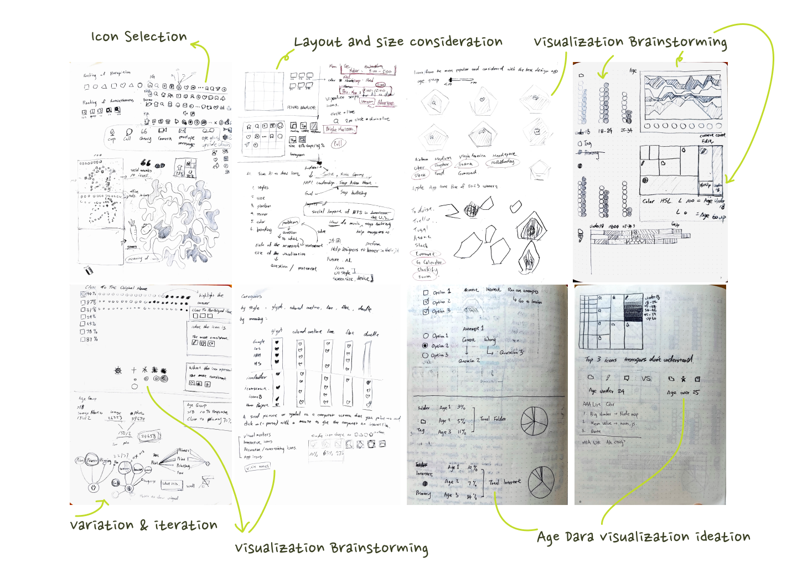
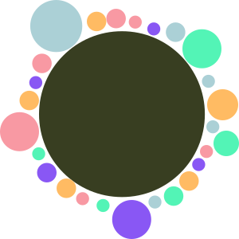
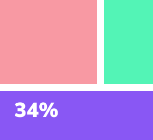
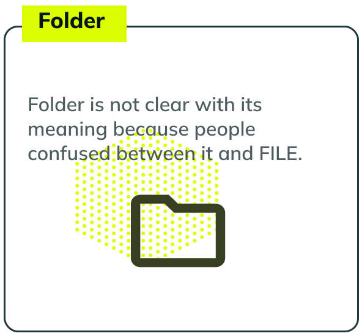

# The Future History of Icons - Forecasting the Use of 30 Common Human-Computer Interaction Icons
A thesis project for Data Visualization Program in Parson Deesign School  
[Project](https://zorawan.github.io/TheFutureHistoryOfIcon/)  
[Thesis](https://docs.google.com/document/d/1EknL8zLd__2AZSUz4rYSHgyJjq3gbQ5b0okhyFnqp50/edit?usp=sharing)  
Main Data Source: Survey Answers  
Supporting Data Sources: The Noun Project | Icon Scout  

This project aims to understand the popularity and interpretation of the 30 commonly used human-computer interaction icons and predict their future usage to guide designers on using and creating icons wisely so that users do not experience poor design and confusion when browsing websites and using applications. Analyzing data are from two resources: user testing data and creation count from two open-source icon libraries, The Noun Project and Icon Scout. While user testing is a standard step in the UX/UI design process, icon user testing is often exclusive to the app or website, making it difficult to reuse the testing outcome for other purposes. This project seeks a more general testing approach to provide designers with a reliable reference for future products through visualization. In conclusion, a unique perspective on the 30 target icons and the methodology used in the project could be extended to the future of icon design to provide more reliable and accurate design guidance.

-------------------------------------------------------------

## :brain: Brainstorming

## :page_facing_up: Data Collection
Two surveys sent out through many online platforms including: Facebook, Linkedin, Whatsapp, Line, and Wechart: 
Survey1 with 17 icons: https://forms.gle/iGj4i5PfDR9LKB5j8  
Survey2 with 13 icons: https://forms.gle/zn11VP3n3Q1SvPd67  

## :broom: Data Cleaning
Data cleaning steps: 
1. For answers with multiple options, I asked users to input them separated by commas. If users separated them by other punctuation marks, I manually changed them to commas for later data processing.
2. To account for users who did not understand the icons’ meaning or had no idea what to guess, I asked users to input “I don’t know”. Similar inputs such as “don’t know” or “no ideas” were also considered the same so I  manually changed it to “I don’t know.”
3. I checked the spelling of the answers and corrected them.
4. I adjusted both to be the same word(s) for answers with singular and plural differences. For example, “notification” and “notifications” became “notification(s).”
5. I translated non-English answers and confirmed their accuracy with native speakers.
6. Lastly, I checked the data consistency, such as formatting all words with capitalized first letters to ensure the data could be used for future data processing and visualization.

## :bar_chart: Visualization

#### Recognition Testing
Survey data using circular packing  
 
 
     

Survey data devided by age groups using tree map  

 
 
     
 
#### Icon Creation
Icon creation from open source libraries by bar chart  

 
 
 
<!--
## :star2: Outcome

-->
